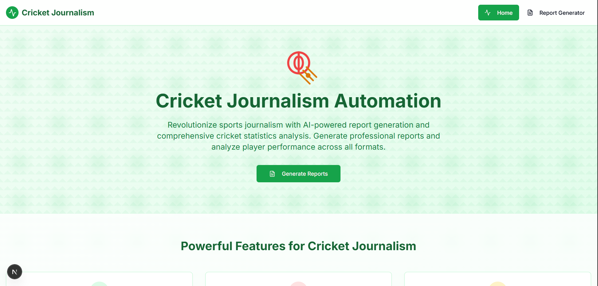
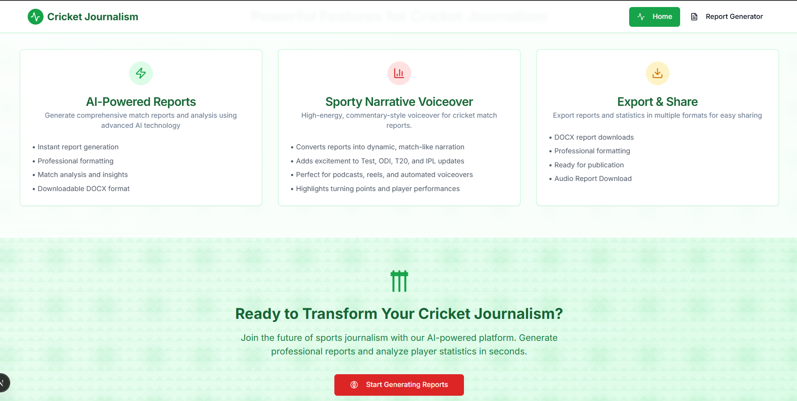
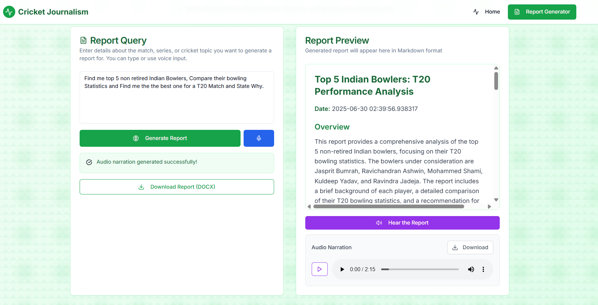

# SportsScribe-AI

SportsScribe-AI is an advanced AI-powered platform designed to revolutionize cricket journalism. It automates the creation of professional cricket match reports and generates dynamic audio narrations—making it the ultimate toolkit for sports journalists, bloggers, and cricket enthusiasts.

---

## Web Interface







---

## 🚀 Key Features

### 🏏 AI-Powered Cricket Report Generation
- Instantly generate comprehensive, professional-quality cricket match reports using advanced AI models.
- Supports all major cricket formats: Test, ODI, T20, and IPL.
- Reports include match summaries, turning points, player highlights, expert analysis and player statistics.

### 📝 Export & Share Reports
- Download reports in **DOCX** formats, ready for publication or sharing.
- Professionally formatted for easy integration into blogs, news portals, and print media.

### 🎙️ Sporty Narrative Voiceover
- Convert generated reports into high-energy, commentary-style audio narrations.
- Perfect for podcasts, reels, and automated voiceovers.
- Highlights key moments and player performances with dynamic narration.

### 🌐 Modern Web Interface
- Built with Next.js and Tailwind CSS for a fast, responsive, and visually appealing experience.
- Intuitive UI for generating, previewing, and downloading reports and audio.

---

## Some Sample Reports along with the query and their Audio narration

- [Career of KL Rahul](./Results/KL%20RAHUL/)
- [Bowling Of Jasprit Bumrah](./Results/Jasprit%20Bumrah/)
- [Top 5 Indian Bowlers Comparision](./Results/Top%20Indian%20Bowler/)
- [Top 5 Indian Batsmen Comparision](./Results/Top%20Indian%20Batsmen/)

## 🗂️ Project Structure

```
SportsScribe-AI/
├── agents/
│   ├── FinalDrafter.py
│   ├── GetMatchDetails.py
│   ├── GetPlayerStats.py
│   ├── Getting_IDs.py
│   ├── report_narration.py
│   ├── ReportSavingAgent.py
│   ├── server.py
│   ├── SportsJournalist.py
│   └── WebAgent.py
├── ui/
│   ├── app/                   # Next.js app directory (pages, routes)
│   ├── components/            # React components (Navbar, UI, etc.)
│   ├── public/                # Static assets
│   ├── styles/                # Tailwind and global CSS
│   ├── package.json           # Frontend dependencies
│   ├── tailwind.config.js
│   ├── postcss.config.js
│   └── ...                    # Other config files, 
├── requirements.txt           # Python dependencies
├── README.md                  # Project documentation
├── .gitignore
└── ...                        # Misc files (.env, etc.)
```

---

## ⚡ Getting Started

### Prerequisites

- Python 3.10+
- Node.js 18+ and npm (or pnpm)
- ffmpeg (for audio narration)

### 1. Backend Setup (FastAPI)

```sh
pip install -r requirements.txt
cd agents
python server.py
```
Backend runs at `http://127.0.0.1:8000`

### 2. Frontend Setup (Next.js)

```sh
cd ui
npm install --legacy-peer-deps
npm run dev
```
Frontend runs at `http://localhost:3000`

### 3. Set up the enviornment Variables
- Create a .env file in the root directory

```
GROQ_API_KEY= <YOUR_GROQ_API_KEY> 
GOOGLE_API_KEY= <YOUR_GEMINI_API_KEY>
TAVILY_API_KEY= <YOUR_TAVILY_API_KEY>
X-RAPID-API-KEY= <YOUR_X_RAPID_API_KEY>
X-RAPID-API-HOST= <YOUR_X_RAPID_API_HOST>
GOOGLE_MODEL1= <GOOGLE_LLM_MODEL_OF_YOUR CHOICE>
GOOGLE_MODEL2 = <GOOGLE_LLM_MODEL_OF_YOUR CHOICE>
```

- [Get Your Groq API Key](https://console.groq.com/docs/overview)
- [Get Your Google API Key](https://console.cloud.google.com/)
- [Get Your Tavily API Key](https://tavily.com/)
- [Get Your X-Rapid API Key and HOST](https://rapidapi.com/cricketapilive/api/cricbuzz-cricket)
- [Get Your Google LLM Model](https://ai.google.dev/gemini-api/docs/models)
---

## 🛠️ Tech Stack

<table>
  <thead>
    <tr>
      <th>Category</th>
      <th>Technologies</th>
    </tr>
  </thead>
  <tbody>
    <tr>
      <td><strong>Framework</strong></td>
      <td>
        
        
        
      </td>
    </tr>
    <tr>
      <td><strong>Language</strong></td>
      <td>
        
        
      </td>
    </tr>
    <tr>
      <td><strong>Libraries</strong></td>
      <td>
        
        
        
        
        
        
        
        
      </td>
    </tr>
  </tbody>
</table>

## Multi Agent Architecture of SportsScribe-AI


